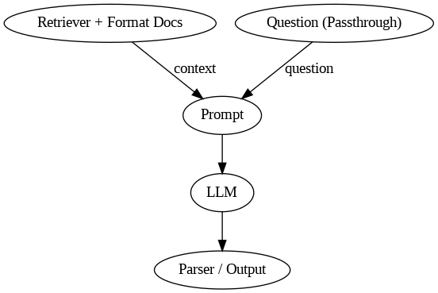
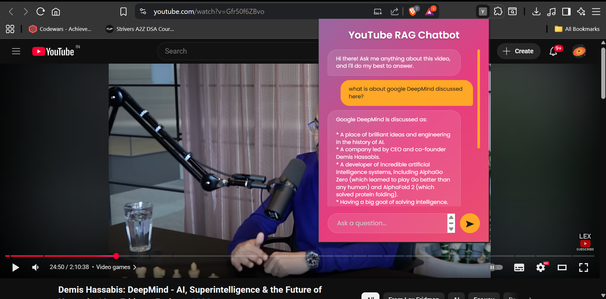

# YouTube RAG Chatbot 💬

An intelligent Chrome extension chatbot for YouTube videos. It leverages a **local Retrieval-Augmented Generation (RAG) backend** to analyze video transcripts and answer user questions in real-time.

---

## Features

- **Instant Q&A:** Ask questions about the content of the YouTube video you are currently watching.  
- **Dynamic UI:** Clean, modern, and responsive chat interface built with HTML, CSS, and JavaScript.  
- **Local RAG Backend:** All AI processing runs locally, ensuring privacy and control.  
- **Easy Installation:** Load as an unpacked extension in any Chromium-based browser (Chrome, Brave, Edge).

---

## Tech Stack

### Frontend (Chrome Extension)
- `HTML` (`popup.html`)
- `CSS` (`style.css`)
- `JavaScript` (`popup.js`)

### Backend (Local Server)
- `Python`
- `FastAPI` for API server (`main.py`)
- RAG Libraries:
  - `langchain`
  - `transformers`
  - `faiss-cpu`
  - Others listed in `requirements.txt`

---

## RAG Architecture



*Illustration of the RAG pipeline showing retrieval, vector store, and LLM components.*
---

## Interface


## Folder Structure


---
### Folder Structure

Here is an overview of the key files in this project:

```
.
├── 📄 manifest.json       # Chrome extension configuration and permissions
├── 📄 requirements.txt    # Python backend dependencies
├── 🐍 main.py             # Main backend file (API server)
├── 🐍 rag_utils.py        # Helper functions for the RAG model
├── 🌐 popup.html           # Extension's HTML structure
├── 🎨 style.css           # Styling for the extension
└── 📜 popup.js             # Frontend logic and API communication
```

---

### Setup and Installation

To get this project running, you need to set up the Python backend and then install the Chrome extension.

### Prerequisites

-   **Python 3.8+**
-   **Google Chrome** or another Chromium-based browser.

### 1. Backend Setup

First, set up and run the local Python server which will handle the AI logic.

**A. Create a Virtual Environment**

It's highly recommended to use a virtual environment to manage project dependencies.

```sh
# Navigate to your project directory
cd path/to/your/project

# Create a virtual environment named 'venv'
python -m venv venv
```

**B. Activate the Environment and Install Dependencies**

-   **On Windows (PowerShell):**
    ```sh
    .\venv\Scripts\Activate
    ```
-   **On macOS/Linux:**
    ```sh
    source venv/bin/activate
    ```

Now, install the required Python packages:

```sh
# Install all packages from the requirements file
pip install -r requirements.txt
```

**C. Run the Backend Server**

Start the server from your terminal. Assuming you are using FastAPI with Uvicorn (a common choice for this setup):

```sh
# The command might be `python main.py` if you are using Flask
uvicorn main:app --reload
```

The server should now be running on `http://127.0.0.1:8000`. Keep this terminal window open.

### 2. Frontend (Chrome Extension) Setup

Next, load the extension into your browser.

1.  Open **Google Chrome** and navigate to `chrome://extensions`.
2.  Enable **"Developer mode"** using the toggle switch in the top-right corner.
3.  Click the **"Load unpacked"** button that appears.
4.  In the file selection dialog, choose your entire project folder.
5.  The **"YouTube RAG Chatbot"** should now appear in your list of extensions. Make sure it's enabled!

---

### Usage

1.  Pin the extension to your toolbar for easy access.
2.  Navigate to any YouTube video page.
3.  Click the extension icon to open the chat popup.
4.  Type your question into the input box and press **Enter** or click the **send button**.
5.  Your question will appear instantly, followed by the bot's answer once it's generated by the local backend.